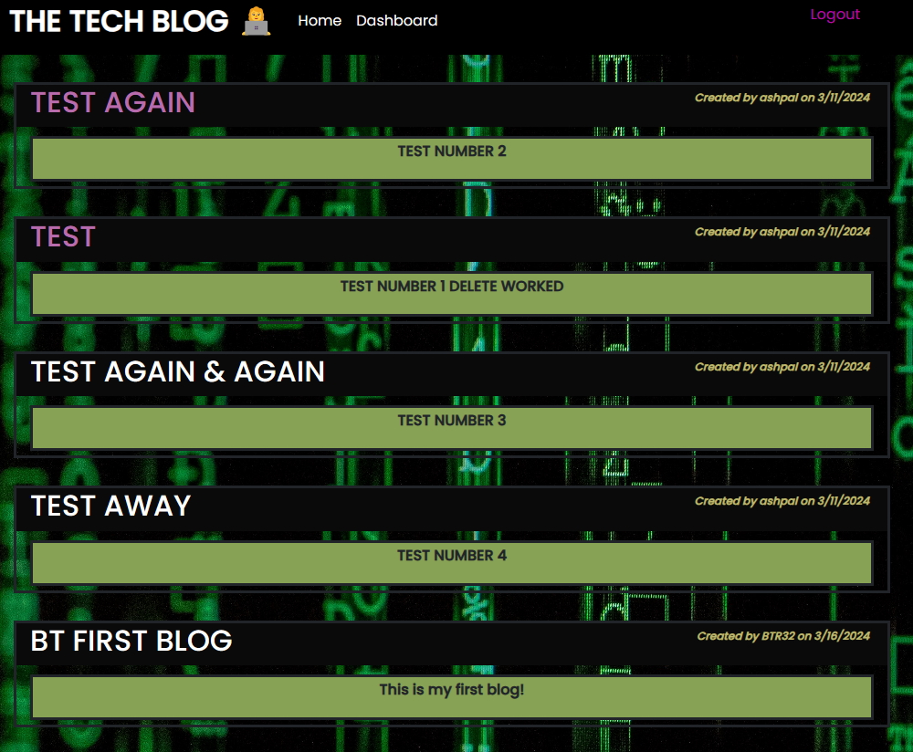
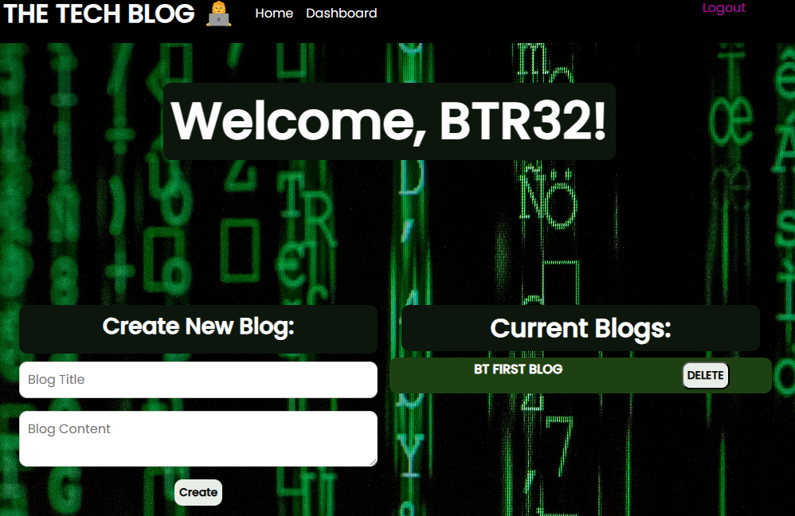
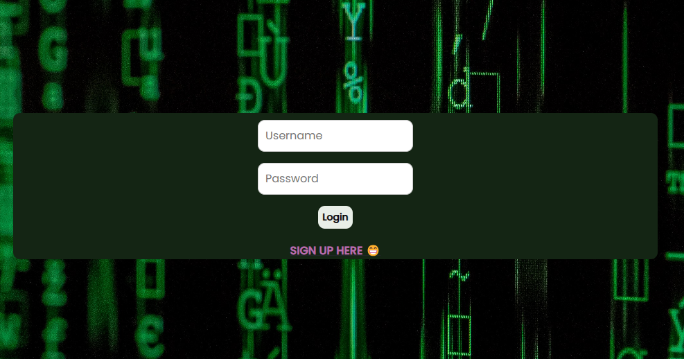
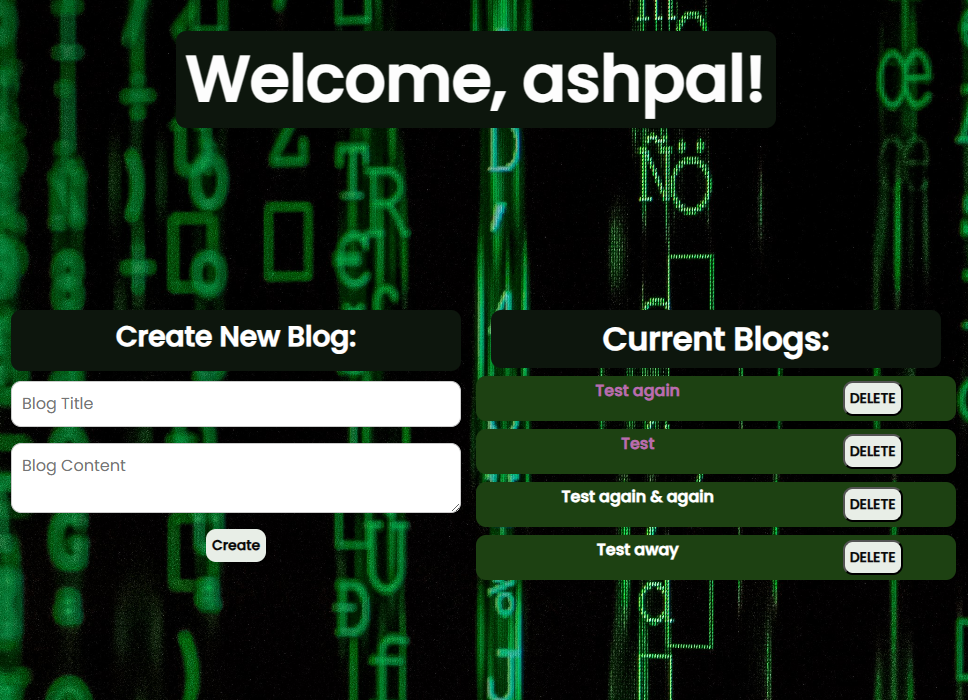
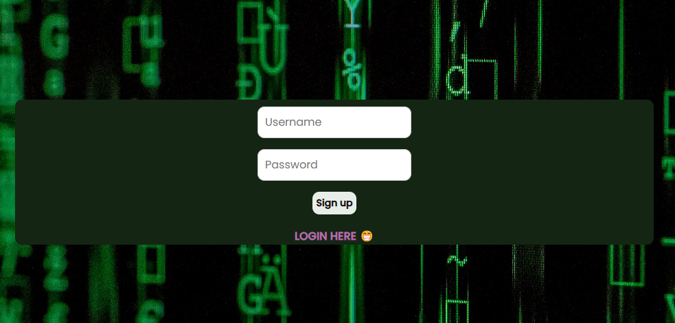

# Tech Blog Application

## Table of Contents
- [Description](#description)
- [Features](#features)
- [Installation](#installation)
- [Usage](#usage)
- [Assets](#assets)
- [Deployed Link](#deployed-link)
- [Links](#links)
- [License](#license)

### Description
The Tech Blog application is a platform for users to publish and share blog posts related to technology. It allows users to register, log in, create, edit, and delete their blog posts, as well as comment on others' posts.

The application is built using the Model-View-Controller (MVC) architectural pattern, with Handlebars.js used for templating on the client-side and Node.js with Express.js on the server-side.

### Features
- User authentication: Users can register, log in, and log out.
- Create and edit blog posts: Authenticated users can create new blog posts and edit their existing posts.
- Commenting: Users can comment on blog posts.
- Dashboard: Authenticated users have access to a dashboard where they can view and manage their posts.
- Responsive design: The application is designed to be responsive and work well on different devices and screen sizes.

### Installation
- Clone this repository to your local machine.
- Navigate to the project directory.
- Install the dependencies.
- Set up the database.

### Usage
- Start the server: `npm start`
- Open your web browser and navigate to http://localhost:3001 to access the Tech Blog application.
- Register for an account or log in if you already have one.
- Start creating and managing your blog posts!

### Assets

### Deployed Link

### Link

GitHub: https://github.com/ASHLOUISE

### License
This project is licensed under the MIT License.

